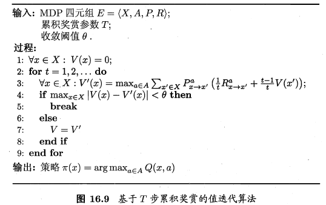
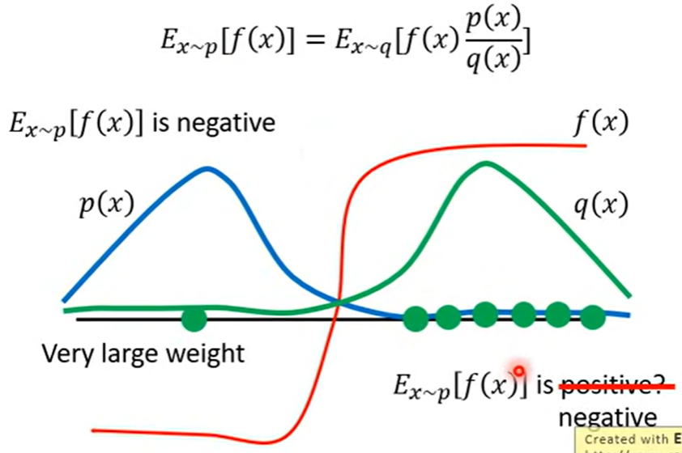
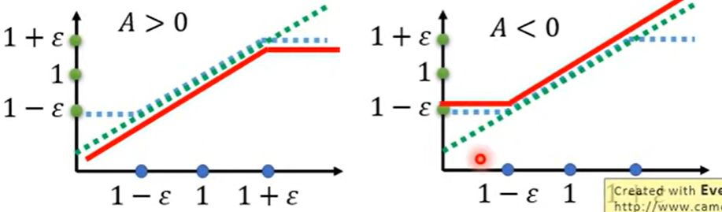

## 强化学习&深度强化学习笔记
### 一些基本概念
- 定义：智能体与环境的不断交互（即在给定状态采取动作），进而获得奖励，此时环境从一个状态转移到下一个状态。智能体通过不断优化自身动作策略，以期待最大化其长期回报或收益（奖励之和）。
- 状态State：The state s is a complete description of the state of the world where the states are fully observable. Whereas observation o is a partial description of the state of the world.
- 动作Action：The agent performs the action in the environment to reach the next state from the current state.
- 策略Policy： Deterministic Policy确定性策略$\mu(s) = a$ 和Probility Policy$\pi(a,s) = Pr(a \mid s)$
  **$$p(\tau) = p(s_0)p_{\theta}(a_0\mid s_0)p(s_1\mid s_0,a_0)p_{\theta}(a_1\mid s_1)p(s_2\mid s_1,a_1)\cdots\\
  \text{上式中$p(s_{n+1}\mid s_n,a_n)$可能不是概率，具体取决于环境}$$**
- 奖励Reward and Return：某一个tiemstep的reward为：$r_t = R(s_t,a_t,s_{t+1})$
  - Finite-horizon undiscounted return:$$R(\tau) = \sum_{t = 0}^Tr_t\quad \text{where } \tau = (s_0,a_0,s_1,a_1,\cdots)$$
  - Infinite-horizon discounted return:$$R(\tau) = \sum_{t = 0}^\infty \gamma^{t}r_t \quad \text{where $\gamma$ is discounting factor}$$
- Value function：分为状态值函数和状态动作值函数，模型未知（免模型学习）时二者难以转换。
  - state-value function：the expected total reward.$$V^\pi(s) = \mathbb{E}[\sum_{i = 1}^T]\gamma^{i-1}r_i \quad \forall s \in \mathbb{S} $$**Optimal state-value function** has high possible value function compared to other value function.$$V^*(s) = \max_{\pi}V^{\pi}(s)\ \ \forall s \in \mathbb{S}$$**optimal policy**:  $\pi^{*} = \argmax_{\pi} V^{\pi}(s) \ \ \forall s \in \mathbb{S}$
  - Action-value function: the expected return for an agent starting from state s and taking arbitrary action a then forever act according to policy $\pi$.
- 策略迭代和值迭代：不断迭代进行策略评估和改进，直到策略收敛、不再改变为止.这样的做法称为"策略迭代"。策略改进与值函数的改进时一致的，因此可以将策略改进视为值函数的改善，值迭代如下图所示：

### 常见强化学习算法及分类
#### 分类标准
- 根据Agent训练与测试采用的策略是否一致，有off-policy和on-policy。**on-policy相当于自己与环境交互，学到知识；off-policy相当于看别人与环境交互，学到知识。** 例如DQN算法中，训练采用$\epsilon-greedy$策略，在实际使用时采用$a^* = \argmax_{a} Q^{\pi} (s,a)$策略。
- 策略优化方式不同:基于价值、基于策略、Actor-Critic Algorithms。
#### Policy Gradient
一种基于策略优化的算法。在强化学习任务中，我们希望T步累计奖赏的期望最大，即
$$\overline{R}_{\theta} = \sum_{\tau}R(\tau)p_{\theta}(\tau) = E_{\tau \sim p_{\theta}(\tau)}[R(\tau)]$$想让上述期望最大，算法采用类似gradient descent方法，因此有：$$\begin{align*}
  \nabla \overline{R}_{\theta}  &= \sum_{\tau}R(\tau)\nabla p_{\theta}(\tau)= \sum_{\tau}R(\tau)p_{\theta}(\tau)\frac{\nabla p_{\theta}(\tau)}{p_{\theta}(\tau)}\\
  & = \sum_{\tau}R(\tau)p_{\theta}(\tau)\nabla\log p_{\theta}(\tau)\\
  &= E_{\tau \sim p_{\theta}(\tau)}[R(\tau)\nabla \log p_{\theta}(\tau)] \approx \frac{1}{N}\sum_{i = 1}^N R(\tau^i)\nabla \log p_{\theta}(\tau^i)\\
  & = \frac{1}{N}\sum_{i = 1}^N \sum_{t = 1}^T R(\tau^i)\nabla\log p_{\theta}(a_{t}^i\mid s_{t}^i)\\
  \theta  \leftarrow &\theta + \eta \nabla \overline{R}_{\theta}
\end{align*}$$$\nabla f(x) = f(x)\nabla \log f(x)$
上述算法存在两个问题：一是环境中可能所有的状态动作对应的reward均为正，在采样数不足时，采样到的动作的weight会上升，没被采样的动作自然下降，但这显然是不合理的；二是所有状态动作对采用一样的reward也不合理，评价动作只需考虑之后的情况。如下式子可帮助改进：$$\nabla \overline{R}_{\theta} \approx \frac{1}{N}\sum_{i = 1}^N \sum_{t = 1}^T (\sum_{t^\prime =t}^T \gamma^{t^\prime-t} r^i_{t^\prime} - b) \nabla \log p_{\theta}(a_t^i\mid s_{t}^i)\qquad b \approx E[R(\tau^i)]\\
\text{Define Advantage function } A^\theta(s_t,a_t) = \sum_{t^\prime =t}^T \gamma^{t^\prime-t} r^i_{t^\prime} - b$$
#### PPO算法
off-policy方法，好处是可以重复利用采样到的数据训练$\theta$，原本policy descent在用$\tau^1$更新$\theta$后就需要重新采样$\tau^2$，效率不高。要理解PPO，首先要了解**重要性采样的概念**
- $$E_{x\sim p}[f(x)] \approx \frac{1}{N}\sum_{i = 1}^N f(x^i)\quad x^i\text{ is sampled from }p(x)
$$现在的问题是我们只能从$q(x)$中采样$x^i$,因此有：$$E_{x\sim p}[f(x)] = \int f(x)p(x)dx = \int f(x)\frac{p(x)}{q(x)}q(x)dx = E_{x \sim q}\left[f(x)\frac{p(x)}{q(x)}\right]$$在使用重要性采样时还需要使得$p,q$尽可能相似，否则可能出现下图所示的问题，即在采样数不够的情况下两个期望可能差距很大。

介绍了重要性采样后，我们将其应用到policy gradient中，将其改造为off-policy$$\begin{align*}
  &\nabla \overline{R}_{\theta} = E_{\tau \sim p_{\theta^\prime}(\tau)}\left[\frac{p_\theta (\tau)}{p_{\theta^\prime}(\tau)} R(\tau) \nabla \log p_{\theta}(\tau)\right]\\
\Rightarrow & E_{(s_t,a_t) \sim \pi_{\theta^\prime}}\left[\frac{p_{\theta}(s_t,a_t)}{p_{\theta^\prime}(s_t,a_t)}A^{\theta^\prime}(s_t,a_t)\nabla \log p_{\theta}(a_t^i\mid s_t^i)\right]\\
\Rightarrow & E_{(s_t,a_t) \sim \pi_{\theta^\prime}}\left[\frac{p_{\theta}(s_t\mid a_t)}{p_{\theta^\prime}(s_t\mid a_t)}\frac{p_{\theta}(s_t)}{p_{\theta^\prime}(s_t)}A^{\theta^\prime}(s_t,a_t)\nabla \log p_{\theta}(a_t^i\mid s_t^i)\right]\quad \frac{p_{\theta}(s_t)}{p_{\theta^\prime}(s_t)} \approx 1
\end{align*}$$上述式子是gradient，我们利用$\nabla f(x) = f(x)\nabla \log f(x)$,可以得到PPO中想要优化的式子（去掉gradient）：$$J^{\theta^\prime}(\theta) = E_{(s_t,a_t)\sim \pi_{\theta\prime}}\left[\frac{p_{\theta}(s_t\mid a_t)}{p_{\theta^\prime}(s_t\mid a_t)}A^{\theta^\prime}(s_t,a_t)\right]\\
\Rightarrow \ \ J^{\theta^\prime}_{PPO}(\theta) = J^{\theta^\prime}(\theta) - \beta KL(\theta,\theta^\prime)\\
if \ \ KL(\theta,\theta^\prime) > KL_{\max},\ \ increase \ \ \beta\\
if \ \ KL(\theta,\theta^\prime) < KL_{\min},\ \ decrease \ \ \beta$$上式就是PPO算法优化的公式。事实上，PPO算法的前身TRPO与其非常相似：$$\begin{align*}
  &\max_{\theta} J^{\theta^\prime}_{TRPO} = J^{\theta^\prime}(\theta)\\
  &\text{ s.t. } KL(\theta,\theta^\prime) < \delta
\end{align*}$$注意上述KL散度是计算根据$\theta,\theta^\prime$得到的分布的散度
PPO-clip算法，核心思想就是利用clip函数的特性来约束两个分布不要差距太大：$$J^{\theta^k}_{PPO-clip}(\theta)\approx \sum_{(s_t,a_t)} \min \left(\frac{p_{\theta}(a_t\mid s_t)}{p_{\theta^k}(a_t\mid s_t)}A^{\theta^k}(s_t,a_t),clip\left(\frac{p_{\theta}(a_t\mid s_t)}{p_{\theta^k}(a_t\mid s_t)},1-\epsilon,1+\epsilon \right)A^{\theta^k}(s_t,a_t)\right)$$
